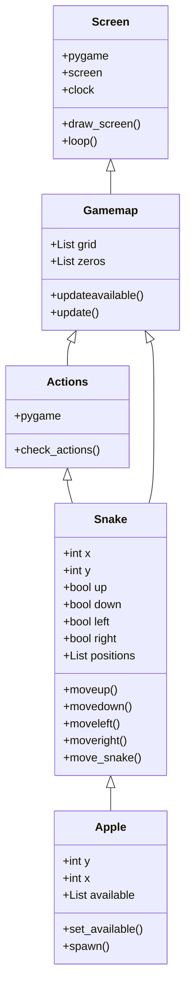

```mermaid
 classDiagram
	Screen <|-- Gamemap
	Gamemap <|-- Actions
	Actions <|-- Snake
	Gamemap <|-- Snake
	Snake <|-- Apple
	class Screen{
		+pygame
		+screen
		+clock
		+draw_screen()
		+loop()
	}
	class Gamemap{
		+List grid
		+List zeros
		+updateavailable()
		+update()
	}
	class Actions{
		+pygame
		+check_actions()
	}
	class Snake{
		+int x
		+int y
		+bool up
		+bool down
		+bool left
		+bool right
		+List positions
		+moveup()
		+movedown()
		+moveleft()
		+moveright()
		+move_snake()
	}
	class Apple{
		+int y
		+int x
		+List available
		+set_available()
		+spawn()
	}

```
