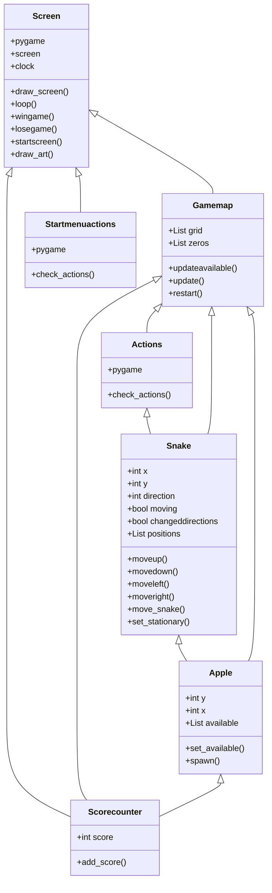
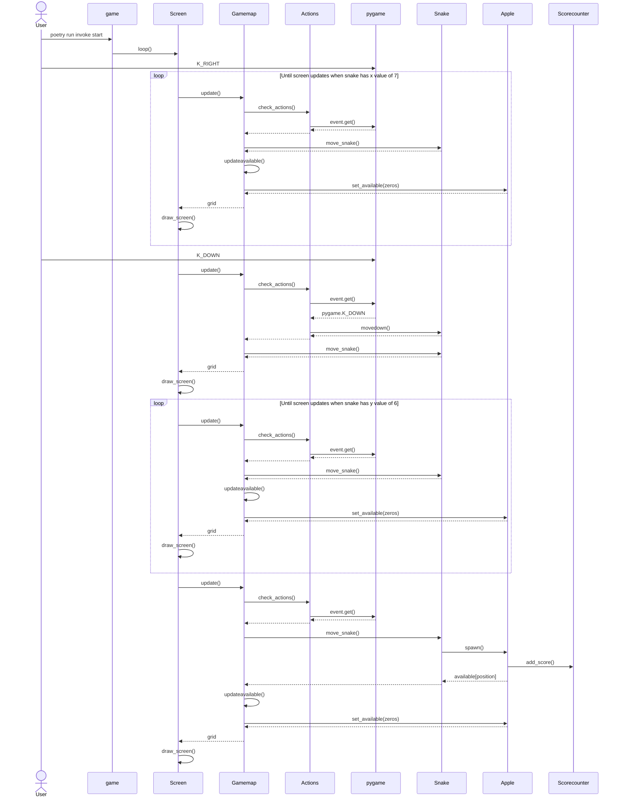

# Arkkitehtuurikuvaus

## Käyttöliittymä

Ohjelma koostuu seuraavista näkymistä:

- Alkuvalikko
- Pelinäkymä
- Voittonäkymä
- Häviönäkymä

Näkymät on toteutettu Screen-luokan metodeina ja jokin niistä on aina ruudulla. Näkymien näyttämisestä ja vaihtamisesta vastaa Screen-luokka.

Kun sovellus käynnistetään, ensimmäisenä näkyviin tulee alkuvalikko. Alkuvalikosta siirrytään pelinäkymään painamalla valikossa olevaa play-näppäintä. Pelitilasta pääsee voittonäkymään vain voittamalla pelin, eli kasvattamalla snaken koko ruudun kokoiseksi. Pelitilasta häviönäkymään siirtyminen tapahtuu, jos snake törmää johonkin ruudun reunoilla olevista seinistä tai itseensä.

## Luokkakaavio:

Ohjelma koostuu luokista Screen, Startmenuactions, Gamemap, Actions, Snake, Apple ja Scorecounter. Ohjelman luokkakaavio näyttää seuraavalta:

## Sekvenssikaavio:

Tilanteessa, jossa käyttäjä käynnistää pelin ja ohjaa snaken ensimmäiselle omenalle mahdollisimman pienellä määrällä käännöksiä, ohjelman toiminnallisuus näyttää seuraavalta:

## Muut toiminnallisuudet

Ohjelma toimii samalla tavalla kunnes peli hävitään tai voitetaan. Näissä tilanteissa snakemap-luokan tila päivittyy ja screen-luokka näyttää pelin loppunäkymän. Jos peli aloitetaan alusta R-näppäimellä, snakemap-luokka huolehtii tarvittavien arvojen nollaamisesta.

## Rakenteen heikkoudet

Ohjelman koodi oltaisiin voitu jakaa useampaan pienempään luokkaan. Tämänhetkisessä tilanteessa ohjelmassa on luokkia, jotka huolehtivat turhan monesta eri asiasta. Lisäksi pylint-virheitä on melko paljon.
