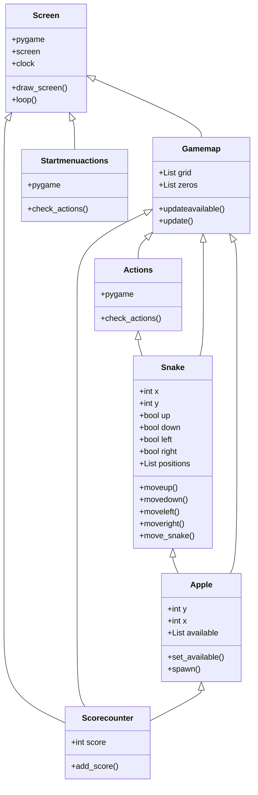

## Luokkakaavio:

Ohjelma koostuu luokista Screen, Startmenuactions, Gamemap, Actions, Snake, Apple ja Scorecounter. Ohjelman luokkakaavio näyttää seuraavalta:

## Sekvenssikaavio:

Tilanteessa, jossa käyttäjä käynnistää pelin ja ohjaa snaken ensimmäiselle omenalle mahdollisimman pienellä määrällä käännöksiä, ohjelman toiminnallisuus näyttää seuraavalta:

