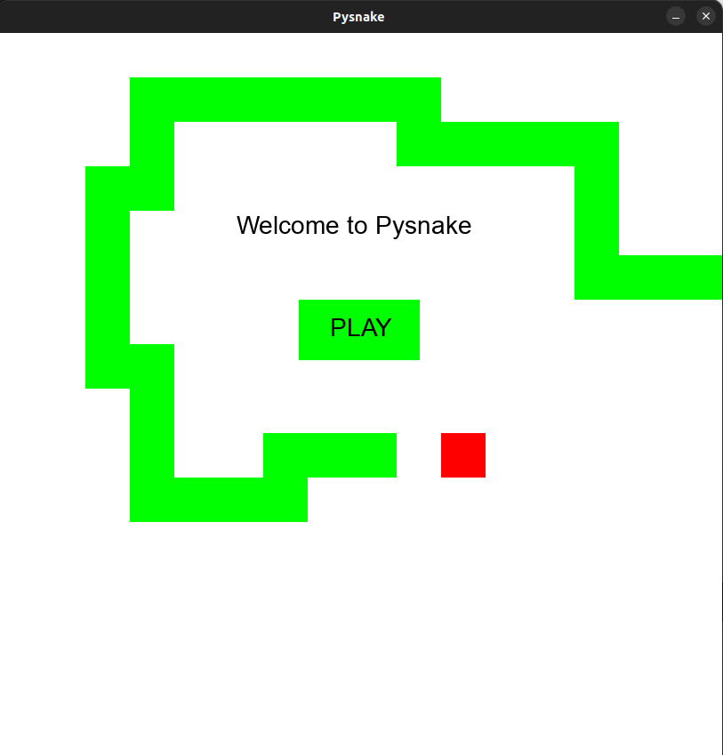
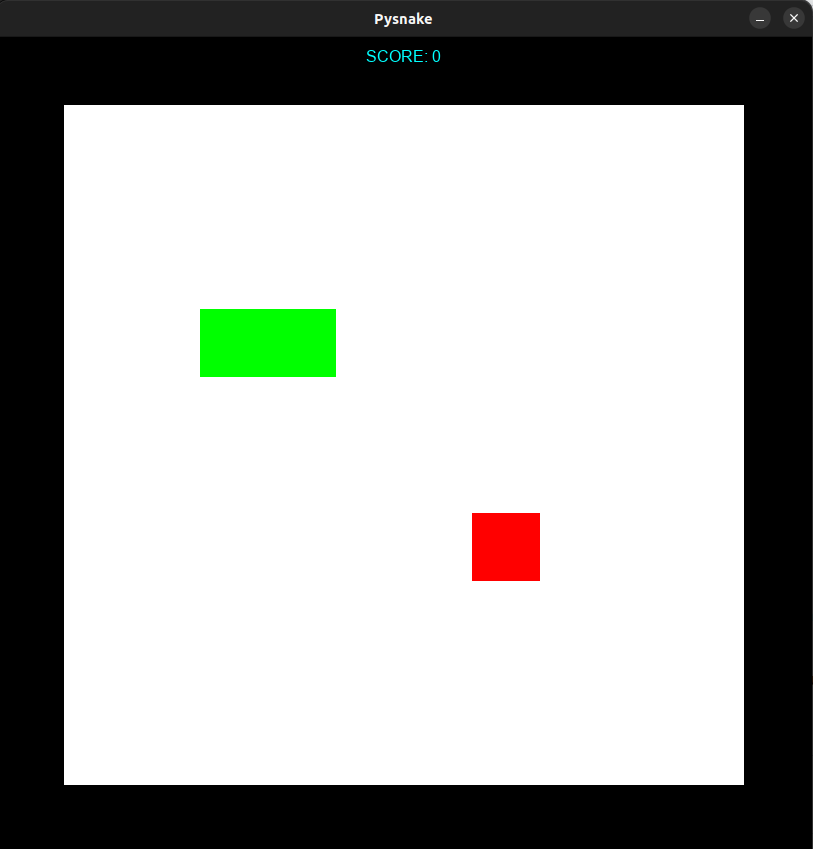

# Käyttöohje

### Ohjelman käynnistäminen

- Komentorivillä ohjelman juurikansiossa, asenna riippuvuudet komennolla: **poetry install**
- Ohjelman voi käynnistää komennolla: **poetry run invoke start**

### Pelin aloittaminen

- Pelin alkuvalikko näyttää seuraavalta:

- Alkuvalikosta pelaamaan pääsee painamalla hiirellä play-näppäintä.

### Pelaaminen

- Aukeaa pelinäkymä, joka näyttää seuraavalta:

- Pelinäkymään päästyään pelin voi aloittaa painamalla nuolinäppäimistä joko ylös, alas tai oikealle. Snake lähtee liikkeelle ja peli alkaa.
- Pelissä voi kääntyä vain 90 asteen kulmassa snaken liikesuunnan suhteen.
- Tarkoituksena on kerätä mahdollisimman paljon omenoita ilman, että snake törmää seinään tai itseensä.
- Snake kasvaa yhden ruudun verran pidemmäksi aina syötyään omenan.
- Pelin voittaa, jos snake kasvaa koko kartan kokoiseksi.
- Pelin häviää, jos snake törmää itseensä tai johonkin karttaa ympäröivistä seinistä.
- Pelin voi käynnistää uudelleen painamalla R-näppäintä näppäimistöllä.
