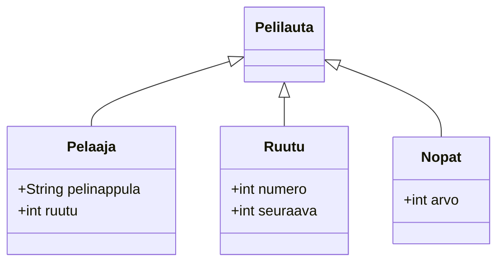

```mermaid
 classDiagram
	Pelilauta <|-- Pelaaja
	Pelilauta <|-- Ruutu
	Pelilauta <|-- Nopat
	class Pelaaja{
		+String pelinappula
		+int ruutu
	}
	class Ruutu{
		+int numero
		+int seuraava
	}
	class Nopat{
		+int arvo
	}
```
