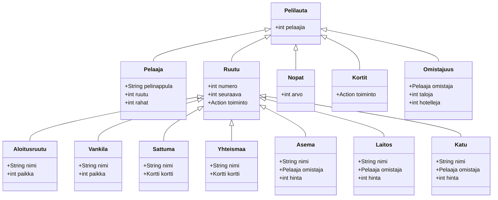

```mermaid
 classDiagram
	Pelilauta <|-- Pelaaja
	Pelilauta <|-- Ruutu
	Pelilauta <|-- Nopat
	Pelilauta <|-- Kortit
	Pelilauta <|-- Omistajuus
	Ruutu <|-- Aloitusruutu
	Ruutu <|-- Vankila
	Ruutu <|-- Sattuma
	Ruutu <|-- Yhteismaa
	Ruutu <|-- Asema
	Ruutu <|-- Laitos
	Ruutu <|-- Katu
	class Pelilauta{
		+int pelaajia
	}
	class Pelaaja{
		+String pelinappula
		+int ruutu
		+int rahat
	}
	class Ruutu{
		+int numero
		+int seuraava
		+Action toiminto
	}
	class Nopat{
		+int arvo
	}
	class Aloitusruutu{
		+String nimi
		+int paikka
	}
	class Vankila{
		+String nimi
		+int paikka
	}
	class Sattuma{
		+String nimi
		+Kortti kortti
	}
	class Yhteismaa{
		+String nimi
		+Kortti kortti
	}
	class Asema{
		+String nimi
		+Pelaaja omistaja
		+int hinta
	}
	class Laitos{
		+String nimi
		+Pelaaja omistaja
		+int hinta
	}
	class Katu{
		+String nimi
		+Pelaaja omistaja
		+int hinta
	}
	class Kortit{
		+Action toiminto
	}
	class Omistajuus{
		+Pelaaja omistaja
		+int taloja
		+int hotelleja
	}
```
