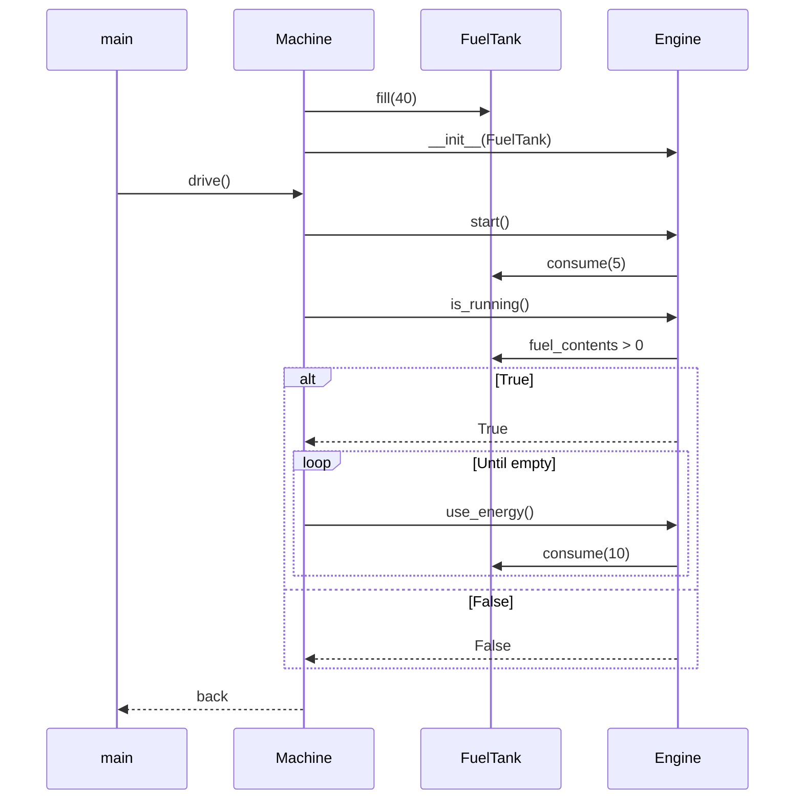

```mermaid
 sequenceDiagram
	participant main
	participant Machine
	participant FuelTank
	Machine->>FuelTank: fill(40)
	participant Engine
	Machine->>Engine: __init__(FuelTank)
	main->>Machine: drive()
	Machine->>Engine: start()
	Engine->>FuelTank: consume(5)
	Machine->>Engine: is_running()
	Engine->>FuelTank: fuel_contents > 0
	alt True
		Engine-->>Machine: True
		loop Until empty
			Machine->>Engine: use_energy()
			Engine->>FuelTank: consume(10)
		end
	else False
		Engine-->>Machine: False
	end
	Machine-->>main: back
```
