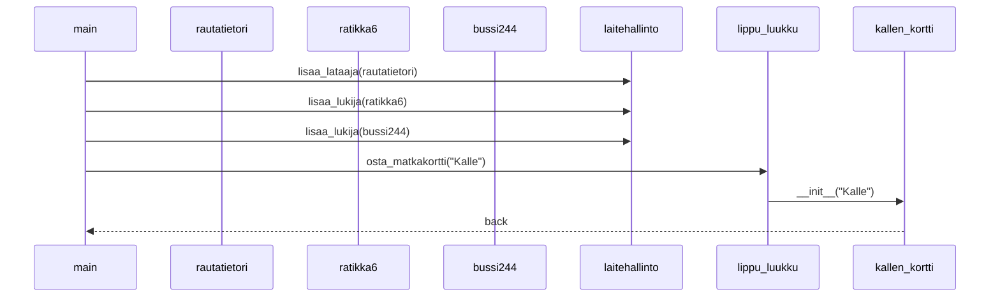

```mermaid
 sequenceDiagram
	participant main
	participant rautatietori
	participant ratikka6
	participant bussi244
	main->>laitehallinto: lisaa_lataaja(rautatietori)
	main->>laitehallinto: lisaa_lukija(ratikka6)
	main->>laitehallinto: lisaa_lukija(bussi244)
	participant lippu_luukku
	main->>lippu_luukku: osta_matkakortti("Kalle")
	lippu_luukku->>kallen_kortti: __init__("Kalle")
	kallen_kortti-->>main: back

```
